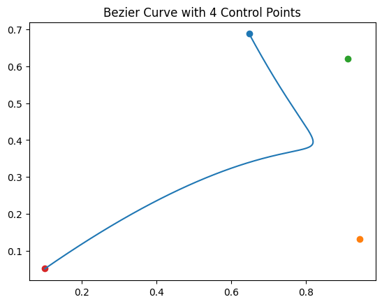
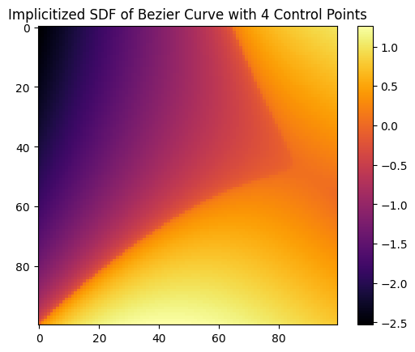
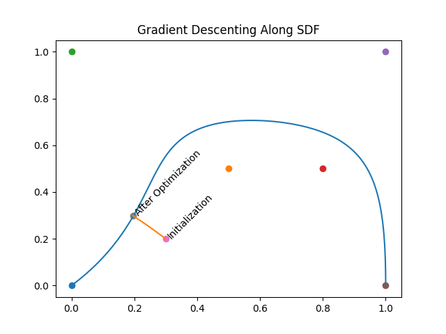
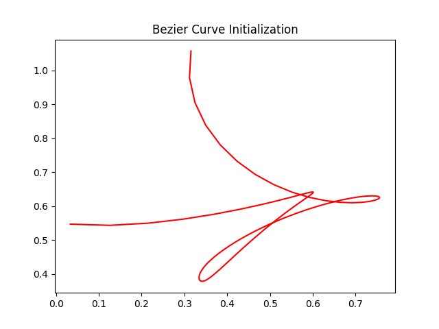
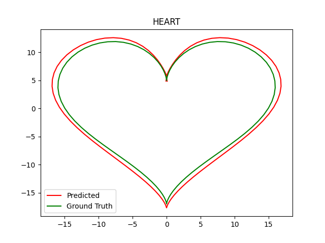

## Bezier Curve Example 

This example has primitives to compute Bezier Curve Coefficients given $N$ control points. Refer to `bezier.slang` file for the slang kernels. Along with computing Bezier Curve Coefficients, and interpolating along the curves, there's also primitives to compute SDF of the Bezier Curve, using implicitization.

Refer to `notebook.ipynb` for an example of initializing a Bezier Curve with 4 control points, and computing SDF. Example Images from the notebook shown below. 





There are 2 toy application examples built on top of the Bezier Curve Primitive

### Nearest point to Bezier Curve from an initialization using SDF based tracing.

A Bezier Curve is initialized with random control points. Then from a random 2D point as an initialization, the point closest to the Bezier curve is reached by minimizing the absolute value of the SDF. `sdf_descent.py` runs the code for this, and has the initialization setup inside. On running the code, an image with the name `sdf_descent_{N}pts.png` will be generated in the same folder. $N$ is the number of control points, specified inside the file. An example of the image is shown below - 



You can run the file as 

```
python3 sdf_descent.py 
```

Parameters such as number of control points, learning rate etc can be changed inside the file.


### Fitting Bezier Curves to Arbitrary shapes 

We show that we can optimize the locations of the control points of Bezier curves to fit to arbitrary parameteric shapes. Refer to `bezier_curvefit.py`. In the file, we have 3 Shapes - `HEART`, `ELLIPSE` and `ASTRID`. The image below shows fitting a heart shape. In the image below, the predicted curve is intentionally scaled so that the ground truth and the prediction are clearly visible. The fit is actually perfect, and makes it hard to see both the curves overlayed separately on the plot. 




You can run the file as 

```
python3 sdf_descent.py 
```
On running the file as is, the optimization loss curve, initial Bezier Curve, and the final fit will be saved in a sub-folder `heart_20` in the current directory. This can be modified from inside the code, along with the number of control points, learning rate etc.